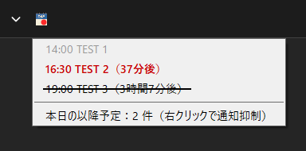
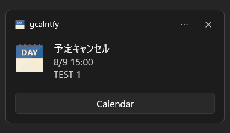
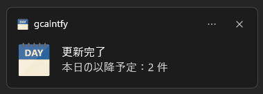

# gcalntfy

[](README.md)
[](README.en.md)
[](https://github.com/aviscaerulea/gcalntfy/releases/latest)
[](LICENSE)
[](https://github.com/aviscaerulea/gcalntfy/actions/workflows/release.yml)

Google Calendar の予定の開始前や変更を Windows 通知で知らせる軽量常駐アプリです。

実測で物理メモリ使用量は 10MB 以下です。（実行環境や 48 時間以内の予定数などにより増減します）



## 機能

- 予定の通知：Google Calendar をポーリングし、予定開始前や変更を Toast 通知と音声で知らせる
- システムトレイ：予定一覧の表示や設定をトレイアイコンから操作できる
  - 過去予定：表示するか ON/OFF 切り替え可能
  - 次の予定：太字で表示（設定時間以内なら赤文字になる）
  - ブラウザ表示：予定やフッターをクリックするとブラウザで開く
- 複数カレンダー対応：メインのカレンダーに加え、外部カレンダーの予定もまとめて扱える

### システムトレイ

トレイアイコンは、以降予定があると右下へバッジを表示します。カーソルを乗せたままにすると、左クリックと同じ予定一覧を表示します。ホバー表示の ON/OFF は、トレイメニューの「マウスホバーで一覧を自動表示」で切り替えます。

予定一覧はフォーカスを奪わないため、直前まで使っていたウィンドウでの入力を妨げません。カーソルがアイコンと一覧の外に出ると自動で閉じます。左クリックは開閉のトグルとして働きます。予定一覧はマウス専用で、キーボードでは操作できません。

予定一覧の各項目には、開始までの残り時間を「（n時間n分後）」形式で表示します。開始が迫った予定は赤文字、次の予定は太字で強調します。フッタークリックで Google Calendar の当日ページを開けます。予定項目の右クリックで通知抑制をトグルできます。

各種設定は、トレイアイコンの右クリックで開くトレイメニューから操作できます。

### Google タスクの通知対応

| 種別 | 対象 |
|---|:---:|
| 時刻を指定した繰り返さないタスク | ○ |
| 繰り返しタスク | — |

繰り返しタスクは Google Calendar API のイベント一覧に一切現れないため、取得段階で対応できません。
Calendar UI の「集中タイム（サイレント モード）」予定はタスクと同じ内部種別（focusTime）で返りますが、判別して通知対象から除外します。

### 通知のタイミング

| タイミング | Toast 通知 | 音声通知 | 条件 |
|---|:---:|:---:|---|
| 予定の開始前（デフォルト 5 分前） | ✓ | ✓ | すべての予定で通知 |
| Google Calendar 側で設定した通知の時刻 | ✓ | ✓ | 予定にポップアップ通知を設定している場合のみ |
| 予定の変更・キャンセル・追加を見つけたとき | ✓ | — | 前回の確認時から内容が変わった場合（開始から 1 時間以上過ぎた予定だけの変更は通知しない） |
| 「今すぐ更新」を実行した後 | ✓ | — | トレイメニューから実行した場合のみ（成功なら本日の残り予定数、失敗なら理由を表示） |

予定のキャンセル検知時の通知例：



「今すぐ更新」の成功時の通知例：



### 通知抑制

予定一覧で予定項目を右クリックすると、通知抑制をトグルできます。

| 項目 | 仕様 |
|---|---|
| 適用範囲 | 選択したインスタンスのみ（繰り返し予定は当日分のみ抑制、翌日以降は通常通知） |
| 抑制対象 | `notify_minutes` 前および reminders タイミングの Toast 通知・音声通知 |
| 抑制対象外 | 変更・キャンセル・新規追加の検知通知（重要情報のため抑制設定に関わらず通知） |
| 永続化 | exe 同フォルダの `muted_events.json` に保存し、再起動後も維持。過去日のエントリは起動時に自動削除 |
| 視覚表現 | 抑制中の予定項目に取消線を表示 |

### 音声通知の有無

| 条件 | 音声通知 |
|---|:---:|
| 音声ファイル（`sound.wav`）が exe と同フォルダに存在する | あり |
| 音声ファイルが存在しない | なし |
| トレイメニューで「音声通知」を OFF に設定している | なし |
| 「マイク/カメラ使用中は無効」が ON かつマイク/カメラ使用中 | なし |

## インストール

### 動作要件

- Windows 10/11
- 初回起動時に Google アカウントでの OAuth 2.0 認証が必要

### 手順

任意フォルダで zip を展開してください。次に `gcalntfy.exe` を実行してください。

または、[Scoop](https://scoop.sh/) でインストールできます。

```powershell
scoop bucket add aviscaerulea https://github.com/aviscaerulea/scoop-bucket
scoop install gcalntfy
```

## 使い方

```powershell
gcalntfy
```

起動するとシステムトレイに常駐し、設定に従って Google Calendar をポーリングして予定を通知します。

初回起動時はアクセストークンがないため、Toast 通知でブラウザが開きます。Google アカウントで「許可」をクリックすると認証が完了し、リフレッシュトークンをレジストリ（`HKCU\SOFTWARE\gcalntfy`）に保存します。以降の起動では再認証は不要です。

## 設定

`gcalntfy.toml` を exe と同フォルダに配置してください。`gcalntfy.local.toml` を併置すると、そちらの記述をキー単位で優先適用します。（変更の反映はアプリ再起動時）

通知音を鳴らすには `sound.wav`（16bit PCM WAV）も exe と同フォルダに配置してください。

```toml
# 時間帯ごとの 1 時間あたりのポーリング回数（0 時〜23 時の 24 要素、最低 1）
schedule = [1, 1, 1, 1, 1, 1, 1, 6, 6, 6, 6, 6, 6, 6, 6, 6, 6, 6, 6, 3, 3, 3, 1, 1]
# イベント開始何分前に通知するか（0〜30、デフォルト 5）
# notify_minutes = 5
# 予定一覧の赤文字閾値（分、デフォルト 60、0 で無効）
# urgent_minutes = 60
# ホバーで予定一覧を表示するまでの遅延（ミリ秒、0〜5000、デフォルト 100、0 で即時）
# hover_delay_ms = 100
# ホバー表示直後のクリック猶予（ミリ秒、0〜5000、デフォルト 300、0 で無効）
# hover_click_guard_ms = 300
# 通知音再生中にミュートし、再生後に復元するプロセス名（空配列で無効）
# duck_targets = ["chrome.exe", "msedge.exe"]
# 追加でポーリングするカレンダー ID（primary は常に有効）
# カレンダー ID は Google Calendar の「設定」→「カレンダーの統合」で確認できる
# ext_calendar_ids = ["abc123@group.calendar.google.com"]

# ガードトーン設定（BLE ヘッドホン対処）
[guard]
# tone_ms = 1500           # ガードトーン長（ms、冒頭・末尾共通、0 で無効、デフォルト: 1500）

# ラウドネスノーマライズ設定
[loudness]
# enabled = true           # 有効/無効（デフォルト: true）
# target = -16.0           # 目標ラウドネス LUFS（デフォルト: -16.0）
# peak_ceiling = 0.891     # トゥルーピーク上限（デフォルト: 0.891 = -1 dBFS）

# 更新チェック設定
[update]
# enabled = true           # 起動時の GitHub 更新チェック有効/無効（デフォルト: true）
```

## 制限事項

繰り返しタスクは Google Calendar API のイベント一覧に一切現れないため、通知対象外です。（時刻を指定した繰り返さないタスクは対象）

## ビルド

```shell
task build
```

Visual Studio 2022 または Build Tools（C++20、MSVC）が必要です。成果物は `out/gcalntfy.exe` に生成します。

ビルド前に `.env` を作成してください。次に `GOOGLE_CLIENT_ID` / `GOOGLE_CLIENT_SECRET` を設定してください。
